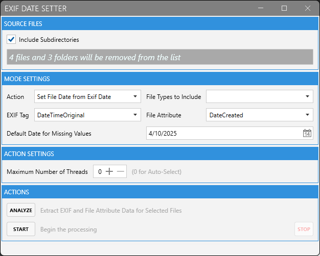

# ExifDateSetter

A Windows desktop application for easily synchronizing dates between EXIF metadata in image files and file system attributes. This tool helps photographers and digital media enthusiasts manage their image collections with precise date control.

## Screenshots





## Features

- **Bi-directional Date Synchronization**:
    - Set file dates (creation/modification) based on EXIF metadata
    - Set EXIF date tags based on file dates (creation/modification)

- **Supports Multiple File Types**:
    - JPG/JPEG
    - CR2 (Canon RAW)
    - PNG
    - TIFF
    - HEIC/HEIF

- **Batch Processing**:
    - Process files in bulk
    - Analyze files to preview dates before processing
    - Recursive folder processing

- **Performance Optimized**:
    - Multi-threaded processing with configurable thread count
    - Progress tracking for large batches

- **User-Friendly Interface**:
    - Drag and drop file/folder support
    - Clean, modern interface using MahApps.Metro styling
    - Detailed operation feedback

## Installation

### Requirements
- Windows OS
- .NET 9.0 or higher

### Installation Options
1. **Download the latest release**:
    - Get the latest version from the [Releases](https://github.com/yourusername/ExifDateSetter/releases) page
    - Run the installer or extract the portable version

2. **Build from source**:
   ```
   git clone https://github.com/yourusername/ExifDateSetter.git
   cd ExifDateSetter
   dotnet build --configuration Release
   ```

## Usage

1. **Add Files or Folders**
    - Click "ADD FILES" or "ADD FOLDER" buttons
    - Drag and drop files/folders into the application
    - Toggle "Include Subdirectories" to process nested folders
    - You can also remove files from the list by dragging them again onto the application drop zone.

2. **Configure Settings**
    - Select action type (EXIF to File Date or File Date to EXIF)
    - Choose which file types to process
    - Select specific EXIF tag (e.g., DateTimeOriginal)
    - Select file attribute (Creation Date or Modified Date)
    - Set default date for files missing date information

3. **Process Files**
    - Click "Analyze" to preview date information
    - Click "Start" to begin processing
    - Use "STOP" to cancel an in-progress operation

## Architecture

The application is built with a clean architecture approach:

- Core library with interfaces and domain models
- WPF UI implementation with MVVM pattern
- Dependency injection for better testability
- Strategy pattern for flexible date conversion operations

## Dependencies

- [MahApps.Metro](https://mahapps.com/) - Modern UI framework
- [ExifLibNet.Updated](https://www.nuget.org/packages/ExifLibNet.Updated/) - EXIF metadata manipulation
- [MetadataExtractor](https://www.nuget.org/packages/MetadataExtractor/) - Image metadata reading
- [CommunityToolkit.Mvvm](https://www.nuget.org/packages/CommunityToolkit.Mvvm/) - MVVM implementation
- [Serilog](https://serilog.net/) - Structured logging
- [Microsoft.Extensions.DependencyInjection](https://www.nuget.org/packages/Microsoft.Extensions.DependencyInjection/) - DI container

## Contributing

Contributions are welcome! Please feel free to submit pull requests or open issues to improve the application.

1. Fork the repository
2. Create your feature branch (`git checkout -b feature/amazing-feature`)
3. Commit your changes (`git commit -m 'Add some amazing feature'`)
4. Push to the branch (`git push origin feature/amazing-feature`)
5. Open a Pull Request

## License

This project is licensed under the MIT License - see the [LICENSE](LICENSE) file for details.

## Acknowledgments

- Thanks to all dependency authors and maintainers
- Inspired by the need for better date management in image collections